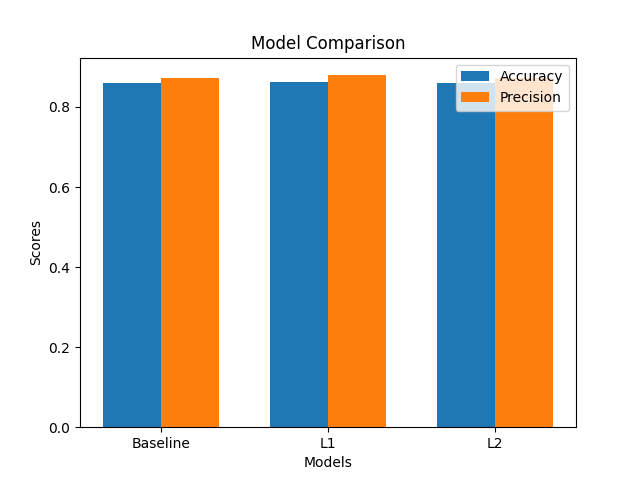

# employee-attrition-prediction-ml
Machine Learning model to predict employee attrition using Logistic Regression with L1 &amp; L2 regularization.

# Employee Attrition Prediction using Logistic Regression

## Project Overview

This project focuses on building a machine learning model to predict employee attrition based on key workplace and demographic factors. The objective is to identify employees who are likely to leave, enabling organizations to take proactive measures to improve retention.

---

## Problem Statement

Employee attrition is a critical issue for organizations, leading to increased hiring costs, loss of experienced talent, and disruption in ongoing projects.

The goal of this project is to develop a predictive model that classifies whether an employee will leave the company using features such as job satisfaction, salary, age, and work-life balance.

---

## Dataset

The dataset includes various employee-related attributes such as:

* Age
* Salary
* Job Satisfaction
* Work-life Balance
* Training Hours
* Bonus
* Other relevant features

**Target Variable:**

* `1` — Employee leaves
* `0` — Employee stays

---

## Methodology

### Data Preprocessing

* Missing value handling
* Encoding of categorical variables
* Feature scaling
* Train-test split

### Model Development

Three models were implemented and evaluated:

* Logistic Regression (Baseline)
* Logistic Regression with L1 Regularization
* Logistic Regression with L2 Regularization

---

## Evaluation Metrics

The models were evaluated using:

* Accuracy
* Precision

Precision is particularly relevant in this context as it ensures that employees predicted to leave are more likely to actually leave.

---

## Results

| Model    | Accuracy | Precision |
| -------- | -------- | --------- |
| Baseline | 0.8593   | 0.8718    |
| L1       | 0.8630   | 0.8793    |
| L2       | 0.8593   | 0.8718    |

---

## Visualization

The above visualization compares model performance based on accuracy and precision.

---

## Regularization

* **L1 (Lasso):** Encourages sparsity and performs implicit feature selection
* **L2 (Ridge):** Improves generalization by penalizing large coefficients

---

## Conclusion

Among the models evaluated, Logistic Regression with L1 Regularization achieved the best performance in terms of both accuracy and precision.

It is therefore selected as the final model for predicting employee attrition.

---

## Business Relevance

The model can assist HR teams in identifying at-risk employees early, allowing for targeted interventions such as improved engagement, compensation adjustments, or workload balancing.

---

## Future Work

* Incorporate Recall and F1-score for a more comprehensive evaluation
* Explore ensemble models such as Random Forest and Gradient Boosting
* Perform feature importance analysis for deeper insights

---

## Requirements

pandas
numpy
scikit-learn
matplotlib
seaborn

---

## Project Structure

employee-attrition-prediction-ml/
├── data/
├── notebook/
├── images/
├── requirements.txt
├── README.md

---

## Author

Syed Moin Ahmed 
